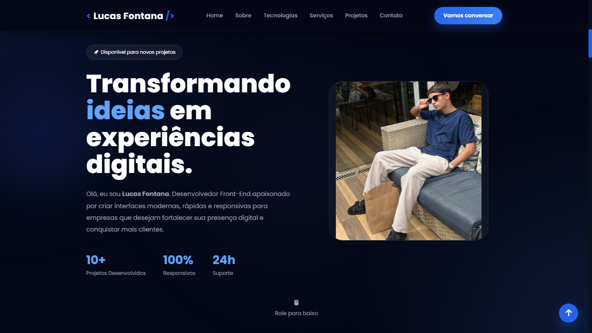

# 🚀 Lucas Fontana | Portfolio

Um portfólio profissional desenvolvido para apresentar meus projetos, habilidades e serviços como Desenvolvedor Front-End.

O objetivo deste projeto é transmitir uma identidade moderna, elegante e tecnológica, proporcionando uma excelente experiência ao usuário e demonstrando minhas capacidades em desenvolvimento web.

---

# 📸 Preview



---

# ✨ Funcionalidades

- ✅ Landing Page moderna
- ✅ Design Premium
- ✅ Interface inspirada em Apple, Vercel e Framer
- ✅ Totalmente responsivo
- ✅ Navbar fixa
- ✅ Scroll suave
- ✅ Hero Section
- ✅ Sobre Mim
- ✅ Tecnologias
- ✅ Serviços
- ✅ Projetos
- ✅ Estatísticas
- ✅ Processo de Desenvolvimento
- ✅ Depoimentos
- ✅ FAQ
- ✅ CTA (Call To Action)
- ✅ Área de Contato
- ✅ Footer
- ✅ Botão Voltar ao Topo
- ✅ Glassmorphism
- ✅ Gradientes modernos
- ✅ Hover Effects
- ✅ Animações suaves
- ✅ Código organizado

---

# 💻 Tecnologias Utilizadas

- HTML5
- CSS3
- JavaScript
- Font Awesome
- Google Fonts

---

# 📁 Estrutura do Projeto

```
Portfolio/
│
├── index.html
├── styles.css
├── script.js
│
├── assets/
│   ├── images/
│   ├── icons/
│   └── preview.png
│
└── README.md
```

---

# 🎨 Design

Este projeto utiliza um visual premium inspirado em grandes empresas de tecnologia.

### Paleta de cores

| Cor | Código |
|------|---------|
| Azul Principal | #2563EB |
| Azul Claro | #3B82F6 |
| Fundo | #050816 |
| Fundo Secundário | #0B1120 |
| Branco | #FFFFFF |
| Cinza Claro | #94A3B8 |

---

# 📱 Responsividade

O site foi desenvolvido para funcionar perfeitamente em:

- 💻 Desktop
- 💼 Notebook
- 📱 Smartphones
- 📲 Tablets

---

# 🚀 Projetos Apresentados

- 💳 Veridian Bank
- 🐶 Wit PetCare
- ⚖️ Rimbaud & Witkowsky Advogados
- 🌦️ Weather App
- 💻 Nebula OS

---

# 📈 Objetivos do Projeto

Este portfólio foi desenvolvido para:

- Demonstrar minhas habilidades técnicas
- Exibir meus projetos
- Apresentar meus serviços
- Atrair novos clientes
- Compartilhar meu trabalho de forma profissional

---

# 💼 Serviços

- Landing Pages
- Sites Institucionais
- Sistemas Web
- Dashboards
- Interfaces Responsivas
- Desenvolvimento Front-End
- Manutenção e Atualização de Sites

---

# ⭐ Diferenciais

- Código limpo
- Componentização
- Organização
- Alto desempenho
- Interface moderna
- Experiência do usuário (UX)
- Design responsivo
- Boas práticas de desenvolvimento

---

# 📌 Próximas Melhorias

- [ ] Blog
- [ ] Modo claro/escuro
- [ ] Internacionalização (PT/EN)
- [ ] Formulário integrado
- [ ] Backend
- [ ] CMS
- [ ] Painel Administrativo
- [ ] PWA
- [ ] Otimização SEO avançada
- [ ] Integração com API de e-mail

---

# 📄 Licença

Este projeto foi desenvolvido para fins de estudo e apresentação profissional.

Sinta-se à vontade para utilizar como inspiração, mas evite copiar integralmente sem realizar personalizações.

---

# 👨‍💻 Autor

## Lucas Fontana

Desenvolvedor Front-End apaixonado por criar interfaces modernas, rápidas e intuitivas.

Meu objetivo é desenvolver soluções digitais que unam design, performance e uma excelente experiência para o usuário.

---

### ⭐ Se este projeto foi útil para você, considere deixar uma estrela no repositório!